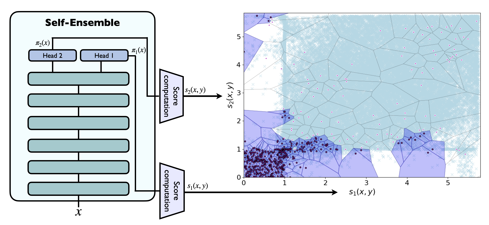

# **Multi-Dimensional Conformal Prediction**
This is the official repository for the ICLR 2025 paper **"Multi-Dimensional Conformal Prediction"**.  
The paper can be found at: [LinkToPaper](https://openreview.net/pdf?id=loDppyW7e2).  

Conformal prediction has attracted significant attention as a distribution-free
method for uncertainty quantification in black-box models, providing prediction
sets with guaranteed coverage. However, its practical utility is often limited when
these prediction sets become excessively large, reducing its overall effectiveness.
We introduce a novel approach to conformal prediction for classification problems, which leverages a multi-dimensional nonconformity score. By
extending standard conformal prediction to higher dimensions, we achieve better separation between correct and incorrect labels. Utilizing this we can focus
on regions with low concentrations of incorrect labels, leading to smaller, more
informative prediction sets. To efficiently generate the multi-dimensional score,
we employ a self-ensembling technique that trains multiple diverse classification
heads on top of a backbone model. We demonstrate the advantage of our approach
compared to baselines across different benchmarks.




## **Installation and Setup**
Before running the scripts, install the required dependencies.  
To create the environment and install dependencies, run:
```bash
pip install -r requirements.txt
```
Ensure you have a GPU-enabled system with CUDA installed if you want to leverage GPU acceleration.

---
## **Quick Demonstration**
For a quick demonstration of the multi-dimensional conformal prediction algorithm check **'demo.ipynb'** notebook.

---
## **Running the Multi-Dim CP Algorithm**
The  script (`multi_dim_cp.py`) computes multi-dimensional conformal prediction sets using nonconformity scores.

### **Step 1: Configure the Multiscore Settings**
Modify the configuration file:
```bash
/configs/multi_dim_cp_config.yaml
```
Key settings:
- `DATASET_NAME`: Name of the dataset (e.g., `'PathMNIST_ICLR'`), it should exist in Multi_Dim_CP/outputs/ .
- `ALPHA`: Coverage threshold (e.g., `0.1` for 90% confidence sets) it should be a float between [0,1-model_accuracy].
- `b`: Number of nearest neighbors to consider (`1` for the multi-score method as described in the paper).
- `N_HEADS`: The nonconformity score wanted dim. should be between [1, number of backbone heads].
- `SCORING_METHOD`: The scoring method (e.g., `RAPS`,`SAPS`,`APS`,`NAIVE`).

### **Step 2: Run the Multiscore Script**
Execute:
```bash
python multi_dim_cp.py
```
This will:
1. Load the dataset and preprocess calibration/test scores.
2. Generate **calibration, optimization, and test sets**.
3. Compute conformal prediction sets as described in the paper.
4. Output **coverage statistics** and **mean prediction set size**.

---

## **Backbone Model**
The backbone model is a **multi-headed ResNet-50** that supports training with different configurations.

### **Step 1: Configure the Training Settings**
Locate the configuration file:
```bash
/backbone/configs/yamnet_config.yaml
```
It contains:
- `general`: Hyperparameters such as **dropout**, **number of heads**, **dataset name**, **batch size**, **saved weight path**, and **output path**.
- `training_plan`: Defines **multiple training steps**, where each step includes:
  - `criterion_name`: Loss function (e.g., CE, CE divergence).
  - `lr_features`: Learning rate for the feature extractor.
  - `lr_heads`: Learning rate for the heads.
  - `num_epochs`: Number of training epochs.
  - `trained_heads`: Specifies which heads to train (`all` or specific ones).
  - `training_phase`: Specifies the type of training:
    - `retrain` / `train_from_scratch` / `eval`
    - `whole` (full model training) or `part` (heads only)

### **Step 2: Train the Backbone Model**
Run:
```bash
python backbone_main.py
```
This will:
1. Load `yamnet_config.yaml`
2. Initialize **Modified ResNet-50**
3. Train/Evaluate according to `training_plan`
4. Save outputs to the configured directory.

### **Step 3: Expected Outputs**
If `save_output` is enabled, results are saved in `.npy` format under:
```bash
/outputs/
```
These include:
- **Test outputs**: `test_outputs_{dataset_name}_{save_name}.npy`           shape (n_heads,test_size,num_labels)
- **Calibration outputs**: `cal_outputs_{dataset_name}_{save_name}.npy`     shape (n_heads,cal_size,num_labels)
- **Test targets**: `test_target_{dataset_name}_{save_name}.npy`            shape (test_size,)
- **Calibration targets**: `cal_target_{dataset_name}_{save_name}.npy`      shape (cal_size,)

---
